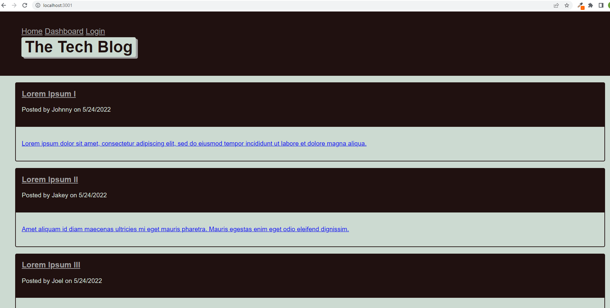

# Tech-Blog
    

## Description
 
 I am presented with the homepage, which includes existing blog posts if any have been posted; navigation links for the homepage and the dashboard; and the option to log in.

 I am prompted to either sign up or sign in.

 I choose to sign up.

 I am prompted to create a username and password

 I click on the sign-up button, my user credentials are saved and I am logged into the site.
 
 I revisit the site at a later time and choose to sign in.

 I am prompted to enter my username and password.

 I am signed in to the site, then I see a navigation links for the homepage, the dashboard, and the option to log out.

 I click on the homepage option in the navigation, then I am taken to the homepage and presented with existing blog posts that include the post title and the date created.

 I click on an existing blog post, when I enter a comment and click on the submit button while signed in, then the comment is saved and the post is updated to display the comment, the comment creator’s username, and the date created.

 When I click on the dashboard option in the navigation, then I am taken to the dashboard and presented with any blog posts I have already created and the option to add a new blog post.

 When I click on the button to add a new blog post, then I am prompted to enter both a title and contents for my blog post.

 When I click on one of my existing posts in the dashboard, then I am able to delete or update my post and taken back to an updated dashboard.

 When I click on the logout option in the navigation, then I am signed out of the site
 
 When I am idle on the site for more than a set time, then I am able to view comments but I am prompted to log in again before I can add, update, or delete comments.

  ## Table of Contents 
  * [Installation](#installation)
  * [Usage](#usage)
  * [License](#license)
  * [Contributing](#contributing)
  * [Tests](#tests)
  * [Questions](#questions)
  
  ## Installation
  
  To install necessary dependencies, type the following command into the terminal:
  
  > npm init -y

  >npm i

  ## ScreenShot

  
  
  ## Usage

  Once the user has navigated to the homepage, they are given the option of logging in or signing up using their email address and password. Without signing up or logging in, the user is able to view blogpost history, but if they would like to add, delete or update posts or comments, they are prompted to log in or create an account. 
  
  ## Additional Information
  heroku deployment: type 'heroku open' on the Terminal. It will open the Note Taker App.
  URL from heroku: https://aqueous-refuge-17540.herokuapp.com/
  
  ## License

  This project is licensed under the MIT license.  

 ## Contributing

  Pull requests are welcome. For any major changes, please open an issue first to discuss what you’d like to change. Please make sure to update tests as appropriate.

 ## Tests

 To run, type into bash terminal:
 > npm start

 ## Questions

 If you have any questions, please visit https://github.com/gisewaltzer or email me at gisewaltzer@gmail.com